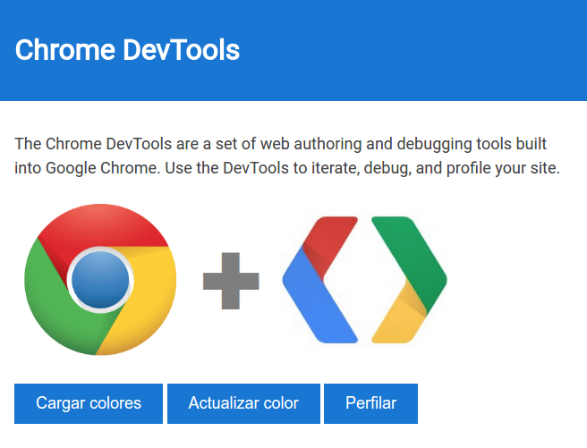

# Chrome DevTools

[](http://meetup.com/BucaramangaJS)
[](./LICENSE)

Aplicación web para experimentar con [Chrome DevTools](https://developers.google.com/web/tools/chrome-devtools/)
usado en la presentación [Chrome DevTools](romelperez.com/charlas/chrome-devtools).



## Instalar

```bash
$ npm install
```

## Ejecutar

```bash
$ npm run start
```
